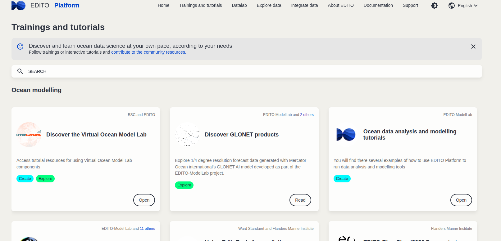

# 👋 Welcome!

## Contributing to EDITO Datalab

Learn how to contribute your knowledge to [**DTO Tutorials** ](https://dive.edito.eu/training).

Tutorials</img>
Presented by **Samuel Fooks**  
_Flanders Marine Institute (VLIZ)_

---

# 🎯 What We'll Go Over

✅ How to become a contributor to EDITO tutorials
✅ Create a shareable tutorial   
✅ Share it publicly via **GitHub**  
✅ Launch it on **EDITO Datalab**  
✅ Register it using `tutorials.json`  
✅ Submit a **merge request**

All this is also covered in [EDITO Datalab Documentation](https://pub.pages.mercator-ocean.fr/edito-infra/edito-tutorials-content/#/).

---

# Get an Account on EDITO

<div class="scrollable">

<span style="font-size: 1.5em; font-weight: bold; color: var(--accent-color);">🌐 Become a Beta Tester:</span>
<a href="https://edito-infra.eu/european-digital-twin-ocean-beta-testing-sign-up-form/" style="font-size: 1.2em; text-decoration: none; color: blue;">Sign up here</a>

<span style="font-size: 1.5em; font-weight: bold; color: var(--accent-color);">📧 Receive an Email:</span>
You will receive an email from the developer team with further instructions.


<span style="font-size: 1.5em; font-weight: bold; color: var(--accent-color);">🔑 Sign up to Mercator Ocean GitLab:</span>
<a href="https://gitlab.mercator-ocean.fr/users/sign_up" style="font-size: 1.2em; text-decoration: none; color: blue;">Create your account</a>

---

# Contribute to the Tutorials Content Repository

<span style="font-size: 1.5em; font-weight: bold; color: var(--accent-color);">🔗 Access Repositories:</span>
Once your account is created, you will be added as a developer to the following repositories:
<ul>
  <li><a href="https://gitlab.mercator-ocean.fr/pub/edito-infra/service-playground" style="font-size: 1.2em; text-decoration: none; color: blue;">Service Playground Repository</a></li>
  <li><a href="https://gitlab.mercator-ocean.fr/pub/edito-infra/process-playground" style="font-size: 1.2em; text-decoration: none; color: blue;">Process Playground Repository</a></li>
  <li><a href="https://gitlab.mercator-ocean.fr/pub/edito-infra/edito-tutorials-content" style="font-size: 1.2em; text-decoration: none; color: blue;">Tutorial Content Repository</a></li>
</ul>

<!-- Tutorials Git Lab</img> -->
</div>

---

# 🧱 I have a new tool/script to share


✅ For example, I’ve written a tutorial in `.Rmd`:

- It explains how to use a tool or perform a task  
- Includes **Markdown** text and **R code chunks**  
- Shows plots, tables, or results inline
- Has some interactivity/user interaction

---

# 🧱 Example: Tutorial Accessing EDITO STAC

## [demo_stac_query.Rmd](https://github.com/samuelfooks/contributing-edito/blob/main/add_tutorial/demo_stac_query.Rmd)

🎬 [Making Tutorial in .Rmd](https://github.com/samuelfooks/contributing-edito/raw/refs/heads/main/assets/videos/makeRmd.mp4)
<video src="../assets/videos/makeRmd.mp4" controls width="800" allowfullscreen></video>


---


# 📂 Recommended Folder Structure

Organize your files like this:

- Include a good 

```
stac-r-tutorial/
├── stac-r-tutorial.Rmd
├── data/
└── README.md
```

---

# 🌐 Create a Repository on your GitHub

- Go to [github.com](https://github.com)
- Click **New repository**
- Set it to **Public**

A demonstration on YouTube
Creating Your First GitHub Repository and Pushing Code [Youtube](https://youtu.be/f26KI43FK58)

---

# 💻 Push Your Local Code to Your Github
<!-- fit -->
<!-- <div class="scrollable"> -->

```bash
# Initialize Git in your local directory (if not already initialized)
git init
# Add all files to the staging area
git add .
git config user.name username
git config user.email usermail@mail.com
# Commit the changes
git commit -m "Initial commit"
# Add the remote origin
git remote add origin https://github.com/username/stac-r-tutorial.git
# Push the changes to GitHub
git branch -M main
git push -u origin main

```

Creating Your First GitHub Repository and Pushing Code [Youtube](https://youtu.be/f26KI43FK58)

<!-- </div> -->

---

# ⚙️ Make your deployment URL

[EDITO Services](https://datalab.dive.edito.eu/catalog/All)

1. **Access the Service Configuration**  
  - Choose a service from the Service Catalog appropriate for your Tutorial
  - ex. R Studio, Jupyter-python

2. **Add Your GitHub Repository**  
  - In the `GIT` section add the url to your tutorial's github repository in the Repository field

3. **Set Resource Limits**  
  - In the resources section, adjust CPU and memory limits as needed 
  - e.g., `1600m` for CPU, `5Gi` for memory

---

# Save Configuration and Test your tutorial

4. **Save the Configuration**  
  - Click **Save** to store your settings. 
  - You will need this URL for the Deployment URL to add your tutorial later

5. **Launch the Service**  
  - Use the **Launch** button to start the service with your configuration.

6. **Test Your Tutorial**  
  - Verify that your tutorial runs as expected in the configured environment.

---

<div class="scrollable">

  ### [Configuring EDITO Service](https://github.com/samuelfooks/contributing-edito/raw/refs/heads/main/assets/videos/configuretutorialservice.mp4)
  <video src="../assets/videos/configuretutorialservice.mp4" controls width="900"></video>

</div>

---

# Test My Tutorial Service

- <span style="color: var(--accent-color); font-size: 1.2em;">🚀</span> **Ran Everything**
- <span style="color: var(--accent-color); font-size: 1.2em;">✅</span> **Checked Output**
- <span style="color: var(--accent-color); font-size: 1.2em;">⚙️</span> <strong>Chosen Configuration Options</strong>:
  - <span style="color: var(--accent-color); font-size: 1.2em;">🔗</span> <strong><a href="https://datalab.dive.edito.eu/launcher/ide/rstudio?name=myeditotutorialtest&version=2.3.1&s3=region-bb0d481d&resources.limits.cpu=1600m&resources.limits.memory=5Gi&git.name=&git.email=&git.repository=https%3A%2F%2Fgithub.com%2Fsamuelfooks%2Fcontributing-edito" target="_blank" style="color: var(--accent-color); text-decoration: underline;">Configuration Link</a></strong>:  
    Allows users to configure how the service launches
  - <span style="color: var(--accent-color); font-size: 1.2em;">🚀</span> <strong><a href="https://datalab.dive.edito.eu/launcher/ide/rstudio?name=myeditotutorialtest&version=2.3.1&s3=region-bb0d481d&resources.limits.cpu=«1600m»&resources.limits.memory=«5Gi»&git.name=«»&git.email=«»&git.repository=«https%3A%2F%2Fgithub.com%2Fsamuelfooks%2Fcontributing-edito»&autoLaunch=true" target="_blank" style="color: var(--accent-color); text-decoration: underline;">Autolaunch Link</a></strong>: Launches the configuration you save

---

## Tutorials respository and the tutorials.json

In order to add our tutorial to the EDITO tutorials we need to add it to the `tutorials.json` list 

[https://gitlab.mercator-ocean.fr/pub/edito-infra/edito-tutorials-content/tutorials.json](https://gitlab.mercator-ocean.fr/pub/edito-infra/edito-tutorials-content/-/blob/main/tutorials.json)

We will clone this repository and add our tutorial to this list, using the the template provided in the README

---

# 🛠️ Clone the Tutorials Repository to your Local PC


🌐 **EDITO GitLab Tutorials**:  
  [https://gitlab.mercator-ocean.fr/pub/edito-infra/edito-tutorials-content](https://gitlab.mercator-ocean.fr/pub/edito-infra/edito-tutorials-content)

<br>

📂 **Clone the Repo**:
  ```bash
  git clone https://gitlab.mercator-ocean.fr/pub/edito-infra/edito-tutorials-content.git
  ```
</div>

---

### [Cloning EDITO Tutorials Content](https://github.com/samuelfooks/contributing-edito/raw/refs/heads/main/assets/videos/clonetutorialscontent.mp4)
<video src="../assets/videos/clonetutorialscontent.mp4" controls width="800"></video>

---

# 🛠️ Make a new branch

<div class="scrollable">
  <span style="color: var(--accent-color); font-size: 1.5em;">🌿</span> **Create a New Branch**:

  ```bash
  git checkout -b my-new-tutorial-branch
  ```

  <span style="color: var(--accent-color); font-size: 1.5em;">📤</span> **Push the New Branch**:

  ```bash
  git push origin my-new-tutorial-branch
  ```

---

  ### [Make branch](https://github.com/samuelfooks/contributing-edito/raw/refs/heads/main/assets/videos/makenewbranch.mp4)
  <video src="../assets/videos/makenewbranch.mp4" controls width="800"></video>

---

## Add your tutorial to 'tutorials.json'

<span style="color: var(--accent-color); font-size: 1.2em;">🔗</span> <strong><a href="https://datalab.dive.edito.eu/launcher/ide/rstudio?name=myeditotutorialtest&version=2.3.1&s3=region-bb0d481d&resources.limits.cpu=1600m&resources.limits.memory=5Gi&git.name=&git.email=&git.repository=https%3A%2F%2Fgithub.com%2Fsamuelfooks%2Fcontributing-edito" target="_blank" style="color: var(--accent-color); text-decoration: underline;">Deployment URL from previous step</a></strong>

<!--- fit -->
```json
{
    "name": {
        "en": "My New Tutorial"
    },
    "abstract": {
        "en": "A short description of your tutorial"
    },
    "authors": [
        "The authors and contributors"
    ],
    "types": [
        "types": [
          {
            "en": "Tutorial"
          }
    ],
    "tags": [
        "create", 
    ],
    "category": "training courses in data science",  // "What-If applications", "Focus applications", "training courses in data science"
    "imageUrl": "https://www.edito.eu/wp-content/uploads/2023/09/favicon.png",
    "articleUrl": {
        "en": "https://github.com/username/stac-r-tutorial", // Your github
    }
    "deploymentUrl": "https://datalab.dive.edito.eu/mydeployment.configuration.git.resources.etc"// DEPLOYMENT URL FROM PREVIOUS STEP
    // parts: [] 
},

```

---

### [Adding to tutorials.json](https://github.com/samuelfooks/contributing-edito/raw/refs/heads/main/assets/videos/addtutorial.mp4)
  <video src="../assets/videos/addtutorialjson.mp4" controls width="800"></video>

---

## Push your updates onto your branch

```bash
# Stage all changes
git add .
# Commit the changes with a descriptive message
git commit -m "Added my awesome tutorial to tutorials.json"
# Push the changes to your branch
git push origin my-new-tutorial-branch
```

---

# 🔁 Create a Merge Request
- Check the gitlab https://gitlab.mercator-ocean.fr/pub/edito-infra/edito-tutorials-content
- See if your commit is in a pipeline and if it passes or not
- If it passes, create a Merge Request
- In your merge request, '@pub/edito-infra/codeowners' to request code owners to review your proposal.

---

# ✅ Final Review Checklist

✔️ Tutorial `.Rmd` created and runs  
➡️ GitHub repo is public and clean  
🔗 Launch link tested  
✅ `tutorials.json` updated
✅ Commited to Gitlab and passes Pipeline
✔️ Merge Request submitted

---

# 🙌 Done!

Once your Merge Request is approved
🎉 You’ve contributed to EDITO Datalab!  
Your tutorial is now one click away from reproducible research!  

💬 Issues? Email [edito-infra-dev@mercator-ocean.eu](mailto:edito-infra-dev@mercator-ocean.eu)  
🔗 [Contribution Docs](https://pub.pages.mercator-ocean.fr/edito-infra/edito-tutorials-content/#/Contribution/tutorials)