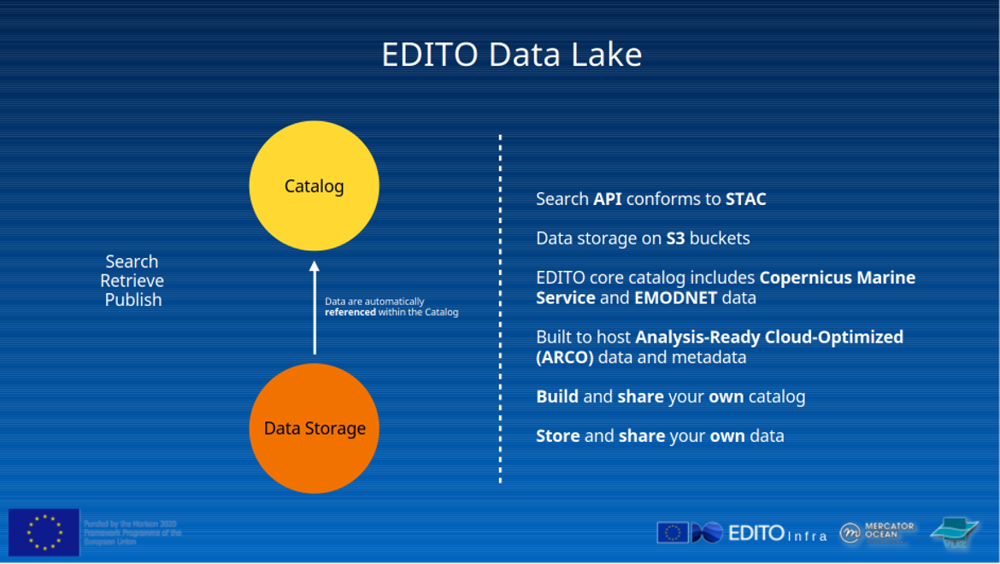

<style>
/******************
Refined Digital Twin Ocean Theme with Responsive Scaling
******************/
:root {
  --background-gradient: linear-gradient(to bottom, #f0faff, #e6f7ff); /* Light ocean gradient */
  --text-color: #00264d; /* Darker blue text */
  --accent-color: #005b99; /* Deep blue accents */
  --border-color: #99ccff; /* Subtle blue border */
  --font-family: 'Lato', sans-serif; /* Modern sans-serif font */
  --icon-size: 5vw; /* Responsive icon size */
  --text-size: 3vw; /* Responsive text size */
}

section {
  background: var(--background-gradient);
  color: var(--text-color);
  font-family: var(--font-family);
  padding: 5%; /* Increased padding for larger elements */
  border-radius: 10px;
  box-shadow: 0 4px 8px rgba(0, 0, 0, 0.1);
  position: relative;
}

section::before {
  content: '';
  position: absolute;
  top: 50%;
  right: 5%;
  transform: translateY(-50%);
  background: url('./images/editoglobe.png') no-repeat center;
  background-size: 300px;
  opacity: 0.1; /* Subtle watermark */
  width: 300px;
  height: 300px;
  z-index: 0;
}

section::after {
  content: '';
  position: absolute;
  bottom: 10px;
  right: 10px;
  background: url('./images/editofish.png'), url('./images/euflag.png');
  background-repeat: no-repeat;
  background-size: 50px, 50px;
  background-position: right bottom, right 60px bottom;
  width: 100px;
  height: 100px;
  z-index: 1;
}

h1, h2, h3 {
  color: var(--accent-color);
  text-shadow: 0 1px 2px rgba(0, 0, 0, 0.2);
  z-index: 2;
  position: relative;
  font-size: var(--text-size); /* Responsive text size */
}

/******************
Reusable Scrollable Style
******************/
.scrollable {
  max-height: 400px;
  overflow-y: auto;
  padding: 1em;
  background-color: var(--background-gradient); /* Match slide background */
  box-shadow: none; /* Remove shadow */
  font-size: 0.9em;
  color: var(--text-color); /* Match text color */
}

/******************
Responsive Icon and Text Styling
******************/
.icon {
  font-size: var(--icon-size); /* Responsive icon size */
  display: inline-block;
  vertical-align: middle;
}

.link-text {
  font-size: var(--text-size); /* Responsive text size */
  font-weight: bold;
  color: var(--accent-color);
}
</style>

# 🌊 Welcome!

## Hands-On with the EDITO Data API

Learn to explore, search, and use marine data from the EDITO Data Lake using the API

👨‍🏫 Presented by Samuel Fooks (VLIZ)

---

# 🌍 What is EDITO?

**EDITO** stands for the **European Digital Twin of the Ocean**.

🧭 It is a European infrastructure to:
- Integrate marine data, models, and services
- Support marine policy (e.g. the Green Deal)
- Help connect EU/national initiatives and citizen science

🌐 Offers:
- Open API access to curated datasets
- Analysis-ready formats (Zarr, Parquet, COG)
- Tools to publish, process, and visualize ocean data

---
# 🚀 Goals for Today

✅ Understand what STAC and S3 are  
✅ Discover ARCO data formats  
✅ Query the API using R or Python  
✅ Find and use public marine datasets

---

# 🗄️ EDITO Data Storage

<div class="scrollable">
EDITO Data Lake uses modern cloud storage solutions to host public datasets. These datasets are stored in:

- **S3-compatible storage**: For scalable and efficient access to large datasets.
- **ARCO formats**: Optimized for analysis-ready workflows.



</div>

---


# 🗄️ EDITO Data Storage

EDITO Data Lake uses modern cloud storage to host analysis-ready data:

- **S3-compatible object storage**
- **Access via URL, anonymous or secure**
- High performance, cloud-native data formats

🌐 Explore: [viewer.dive.edito.eu](https://viewer.dive.edito.eu)

---
# 🌐 What is STAC?

**STAC** = SpatioTemporal Asset Catalog

A community standard for:
- Describing Earth-observation data
- Providing metadata for geospatial assets

Used across satellites, models, and in-situ data.

📚 Learn more: [stacspec.org](https://stacspec.org)

---

# 🧱 STAC Structure

🔹 **Catalogs** – High-level groupings (e.g., "All CMEMS data")  
🔹 **Collections** – Thematic datasets (e.g., temperature, sea level)  
🔹 **Items** – Individual assets with time+space (e.g., file for 2024-01-01)  
🔹 **Assets** – Actual data files: GeoTIFF, Zarr, Parquet...

Each has consistent metadata (bbox, datetime, etc.)

---

# 📦 What is S3?

**Amazon S3** (Simple Storage Service):
- Object storage for files (Parquet, Zarr, GeoTIFF...)
- EDITO uses S3-compatible endpoints to store public datasets

🧪 Works with:
- Python: `s3fs`, `fsspec`, `rioxarray`, `zarr`
- R: `arrow`, `aws.s3`

Access via URLs: `https://...s3...`

---

# 🧬 What is ARCO Data?

**ARCO** = Analysis Ready Cloud Optimized

EDITO adopts modern cloud-friendly formats:
- High performance
- Scalable access
- Efficient for machine learning, large analytics

Let's explore each format!

---

# 🧊 Zarr Format

Zarr is used for chunked N-dimensional arrays (like NetCDF but cloud-native)

✅ Ideal for model outputs, time series, climate reanalyses  
✅ Works well with `xarray`, `kerchunk`, `zarr-python`

🔗 [zarr.readthedocs.io](https://zarr.readthedocs.io)

```python
import zarr
import xarray as xr

xr.open_zarr("https://s3...zarr/", consolidated=True)
```

---

# 🗺️ COG: Cloud Optimized GeoTIFF

COG = regular GeoTIFF + internal tiling and indexing

✅ Works via HTTP range requests  
✅ Great for satellite images, raster maps

🔗 Tools: `rioxarray`, `rasterio`, `QGIS`

```python
import rioxarray
url = "https://...cog.tif"
da = rioxarray.open_rasterio(url)
```

---

# 🗃️ Parquet and GeoParquet

Parquet = columnar tabular format, very efficient  
GeoParquet = Parquet + geospatial metadata

✅ Good for point observations, events, tracks, etc.  
✅ Efficient for large queries and spatial joins

🔗 [parquet.apache.org](https://parquet.apache.org)  
🔗 [geoparquet.org](https://geoparquet.org)

```python
import pyarrow.dataset as ds
import s3fs

fs = s3fs.S3FileSystem(anon=True)
dataset = ds.dataset("s3://...parquet...", filesystem=fs)
df = dataset.to_table().to_pandas()
```

---

# 🔗 EDITO API Endpoints

Base URL for STAC:
```
https://api.dive.edito.eu/data/
```

📖 Docs: [docs.edito.eu](https://docs.edito.eu)  
🔐 No auth needed for public data

Try browsing with a tool like [radiantearth.github.io/stac-browser](https://radiantearth.github.io/stac-browser/#/https%3A%2F%2Fapi.dive.edito.eu%2Fdata%2F?.language=en)

---

# 🔍 Explore Collections (Python)

```python
import requests

url = "https://api.dive.edito.eu/data/collections"
response = requests.get(url)
data = response.json()

print("Found collections:", len(data['collections']))
for col in data['collections'][:5]:
    print(col['id'], ":", col['title'])
```

---

# 🧪 Optional: Find Items in R

```r
library(rstac)

stac_endpoint <- "https://api.dive.edito.eu/data/"
collections <- stac(stac_endpoint) %>%
  rstac::collections() %>%
  get_request()

length(collections$collections)  # how many
```

👉 R packages like `arrow`, `sf`, `terra` also help with asset processing.

---

# 📁 Access Parquet/GeoParquet via Arrow (Python)

```python
import pyarrow.dataset as ds
import s3fs

fs = s3fs.S3FileSystem(anon=True)
dataset = ds.dataset("s3://...your-parquet-folder...",
                     filesystem=fs, format="parquet")

df = dataset.to_table().to_pandas()
print(df.head())
```

---

# Lets Try it out

A sneak peak at a tutorial
 
# 🔗 View the Full Tutorial
<a href="../add-service/docker/output/demo_stac_query.html" style="font-size: 1.2em; text-decoration: none; color: var(--text-color);">Click here to view the full tutorial</a>

---

# 📌 Recap: What You Can Now Do

✅ Understand the EDITO API and data stack  
✅ Find and filter collections/items  
✅ Read Parquet or Zarr data with Python or R  
✅ Build workflows for marine data analysis

🧭 Go explore: [my-ocean.dive.edito.eu](https://my-ocean.dive.edito.eu)

💬 Questions?  
📧 Reach us at: edito-infra-dev@mercator-ocean.eu  
🔗 Docs: [docs.edito.eu](https://docs.edito.eu)  
🛠️ Workshop: [datalab.dive.edito.eu](https://datalab.dive.edito.eu)

🌊 Happy exploring!