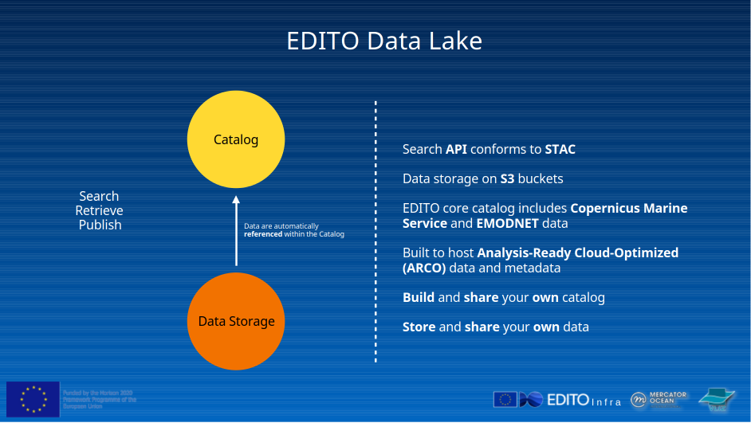

<!-- <style>
/******************
Refined Digital Twin Ocean Theme with Responsive Scaling
******************/
:root {
  --background-gradient: linear-gradient(to bottom, #f0faff, #e6f7ff); /* Light ocean gradient */
  --text-color: #00264d; /* Darker blue text */
  --accent-color: #005b99; /* Deep blue accents */
  --border-color: #99ccff; /* Subtle blue border */
  --font-family: 'Lato', sans-serif; /* Modern sans-serif font */
  --icon-size: 5vw; /* Responsive icon size */
  --text-size: 3vw; /* Responsive text size */
}

section {
  background: var(--background-gradient);
  color: var(--text-color);
  font-family: var(--font-family);
  padding: 5%; /* Increased padding for larger elements */
  border-radius: 10px;
  box-shadow: 0 4px 8px rgba(0, 0, 0, 0.1);
  position: relative;
}

section::before {
  content: '';
  position: absolute;
  top: 50%;
  right: 5%;
  transform: translateY(-50%);
  background: url('./assets/images/editoglobe.png') no-repeat center;
  background-size: 300px;
  opacity: 0.1; /* Subtle watermark */
  width: 300px;
  height: 300px;
  z-index: 0;
}

section::after {
  content: '';
  position: absolute;
  bottom: 10px;
  right: 10px;
  background: url('./assets/images/editofish.png'), url('./assets/images/euflag.png');
  background-repeat: no-repeat;
  background-size: 50px, 50px;
  background-position: right bottom, right 60px bottom;
  width: 100px;
  height: 100px;
  z-index: 1;
}

h1, h2, h3 {
  color: var(--accent-color);
  text-shadow: 0 1px 2px rgba(0, 0, 0, 0.2);
  z-index: 2;
  position: relative;
  font-size: var(--text-size); /* Responsive text size */
}

/******************
Reusable Scrollable Style
******************/
.scrollable {
  max-height: 400px;
  overflow-y: auto;
  padding: 1em;
  background-color: var(--background-gradient); /* Match slide background */
  box-shadow: none; /* Remove shadow */
  font-size: 0.9em;
  color: var(--text-color); /* Match text color */
}

/******************
Responsive Icon and Text Styling
******************/
.icon {
  font-size: var(--icon-size); /* Responsive icon size */
  display: inline-block;
  vertical-align: middle;
}

.link-text {
  font-size: var(--text-size); /* Responsive text size */
  font-weight: bold;
  color: var(--accent-color);
}
</style> -->

# 🌊 Welcome!

## Hands-On with the EDITO Data API

Learn to explore, search, and use marine data from the EDITO Data Lake

👨‍🏫 Presented by Samuel Fooks (VLIZ)

---

# 🌍 What is EDITO?

**EDITO** stands for the **European Digital Twin of the Ocean**.

🧭 It is a European infrastructure to:
- Integrate marine data, models, and services
- Support marine policy (e.g. the Green Deal)
- Help connect EU/national initiatives and citizen science

🌐 Offers:
- Open API access to curated datasets
- Analysis-ready formats (Zarr, Parquet, COG)
- Tools to publish, process, and visualize ocean data


---

# Data in EDITO

The data available in the EU DTO consists of a **STAC (SpatioTemporal Asset Catalog)** as well Data storage on S3 buckets

EDITO Data Lake</img>

---

# 🗄️ EDITO Data Storage

EDITO Data Lake uses modern cloud storage solutions to host public datasets. These datasets are stored in:

- **S3-compatible object storage**
- **Access via URL, anonymous or secure**
- High performance, cloud-native data formats

🌐 Explore: [38 million occurrence records](https://datalab.dive.edito.eu/data-explorer?source=https%3A%2F%2Fs3.waw3-1.cloudferro.com%2Femodnet%2Fbiology%2Feurobis_occurrence_data%2Feurobis_occurrences_geoparquet_2024-10-01.parquet&rowsPerPage=25&page=1&columnVisibility=%7B%7D)

---

### 🗂️ EDITO STAC

EDITO offers a standardized **STAC (SpatioTemporal Asset Catalog)** built on **CMEMS** and **EMODnet** data, designed to integrate diverse marine and environmental datasets.

- 🌍 Based on **OGC STAC API** for easy discovery and access  
- 🌐 Integrates data from multiple domains (ocean, climate, biodiversity)  
- 🔎 Search by time, space, type — with direct links to S3-hosted assets  
- 🤝 Supports both human users and automated workflows  

> A gateway to an **interoperable ocean of FAIR data**

---

# 🌐 What is STAC?

**STAC** = SpatioTemporal Asset Catalog

A community standard for:
- Describing Earth-observation data
- Providing metadata for geospatial assets

Used across satellites, models, and in-situ data.

📚 Learn more: [stacspec.org](https://stacspec.org)

---

# 🧱 STAC Structure

🔹 **Catalogs** – High-level groupings (e.g., "All CMEMS data")  
🔹 **Collections** – Thematic datasets (e.g., temperature, sea level)  
🔹 **Items** – Individual assets with time+space (e.g., file for 2024-01-01)  
🔹 **Assets** – Actual data files: GeoTIFF, Zarr, Parquet...

Each has consistent metadata (bbox, datetime, etc.)

---

# 🔍 Use the EDITO STAC Viewer

[viewer.dive.edito.eu](https://viewer.dive.edito.eu/)

We can follow the STAC structure to the EUROBIS database exported in parquet

Catalog -> Catalog      -> Collection      -> Item
EMODnet -> Biodiversity -> Occurrence data ->  Occurrence data eurobis database observations

---

## [DEMO Using STAC Viewer](https://github.com/samuelfooks/DTO-Bioflow-M13-technical-workshop/raw/refs/heads/main/assets/videos/usingEDITOSTACviewer.mp4)
</img>

Can also view in your browser [radiantearth.github.io/stac-browser](https://radiantearth.github.io/stac-browser/#/https%3A%2F%2Fapi.dive.edito.eu%2Fdata%2F?.language=en)

---

# Search EDITO STAC via the API

Base URL for STAC:
```
https://api.dive.edito.eu/data/
```

📖 Docs: [Interact with Data API](https://pub.pages.mercator-ocean.fr/edito-infra/edito-tutorials-content/#/interactWithTheDataAPI)  

---

#  What is ARCO Data?

**ARCO** = Analysis Ready Cloud Optimized

EDITO adopts modern cloud-friendly formats:
- High performance
- Scalable access
- Efficient for machine learning, large analytics

Let's explore each format!

---

# 🧊 Zarr Format

Zarr is used for chunked N-dimensional arrays (like NetCDF but cloud-native)

✅ Ideal for model outputs, time series, climate reanalyses  
✅ Works well with `xarray`, `kerchunk`, `zarr-python`

🔗 [zarr.readthedocs.io](https://zarr.readthedocs.io)

```python
import zarr
import xarray as xr

xr.open_zarr("https://s3...zarr/", consolidated=True)
```

---

# 🗃️ Parquet and GeoParquet

Parquet = columnar tabular format, very efficient  
GeoParquet = Parquet + geospatial metadata

✅ Good for point observations, events, tracks, etc.  
✅ Efficient for large queries and spatial joins

🔗 [parquet.apache.org](https://parquet.apache.org)  
🔗 [geoparquet.org](https://geoparquet.org)

---

# 📁 Access Parquet/GeoParquet via Arrow (Python)

```python
import pyarrow.dataset as ds
import s3fs

fs = s3fs.S3FileSystem(anon=True)
dataset = ds.dataset("s3://...your-parquet-folder...",
                     filesystem=fs, format="parquet")

df = dataset.to_table().to_pandas()
print(df.head())
```

---

# Lets Explore the EDITO STAC, find an ARCO dataset from Biodiversity


### [viewer.dive.edito.eu](https://viewer.dive.edito.eu/)

---

## Reading parquet

Lets go read that parquet 
https://s3.waw3-1.cloudferro.com/emodnet/biology/eurobis_occurrence_data/eurobis_occurrences_geoparquet_2024-10-01.parquet


---

## For your learning pleasure

---

# 🔍 Explore Collections (Python)

```python
import pystac_client

url = "https://api.dive.edito.eu/data/collections"
editocollections = pystac_client.Client.open(url)
collections = list(editocollections.get_collections())

print("Found collections:", len(collections))
for col in collections[:5]:
    print(col.id, ":", col.title)
    items = col.get_items()
    itemlist = list(items)
    for item in itemlist:
        print(item.properties['title'])
        print(item.assets)
```

---

# 🧪 Optional: Find Items in R

```r
library(rstac)

stac_endpoint <- "https://api.dive.edito.eu/data/"
collections <- stac(stac_endpoint) %>%
  rstac::collections() %>%
  get_request()

length(collections$collections)  # how many
```

👉 R packages like `arrow`, `sf`, `terra` also help with asset processing.

---

# 📌 Recap: What You Can Now Do

✅ Understand the EDITO API and data stack  
✅ Find and filter collections/items  
✅ Read Parquet or Zarr data with Python or R  

🧭 Go explore: [my-ocean.dive.edito.eu](https://my-ocean.dive.edito.eu)
                [viewer.dive.edito.eu](https://viewer.dive.edito.eu/)
💬 Questions?  
📧 Reach us at: edito-infra-dev@mercator-ocean.eu  
🔗 Docs: [Interact with EDITO Data](https://pub.pages.mercator-ocean.fr/edito-infra/edito-tutorials-content/#/interactWithTheDataAPI) 

🌊 Happy exploring!